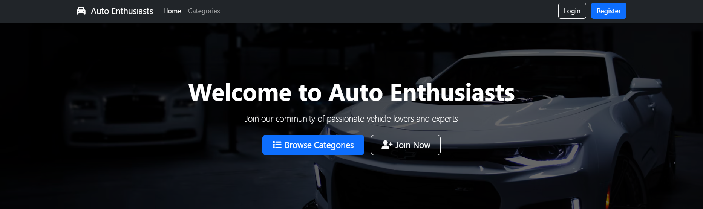

# Auto Enthusiasts Community Forum

Welcome to the **Auto Enthusiasts** platform — a web-based community for vehicle lovers, hobbyists, and industry experts to connect, share knowledge, and engage in topic-specific discussions.

## 🚗 Overview

Auto Enthusiasts is a PHP/HTML-based web application designed to serve as a niche forum where users can:
- Register for an account
- Browse through categories of automotive topics
- Engage in discussions within threaded posts
- View a personalized dashboard

---

## 📁 Project Structure

### `register.html`
- **Purpose:** Frontend form to create a new user account.
- **Features:**
  - Collects username, password, and confirmation
  - Uses Bootstrap classes for UI consistency
  - Redirects or submits data for server-side registration (likely handled by a backend script, not included here)

### `categories.php`
- **Purpose:** Displays a list of automotive categories (e.g., Performance, Maintenance, Customization).
- **Functionality:**
  - Fetches categories from a database
  - Renders them in a card/grid layout
  - Each category links to a `thread.php` page with specific discussions

### `thread.php`
- **Purpose:** Displays discussion threads under a specific category.
- **Features:**
  - Receives category ID via URL query string
  - Queries the database to retrieve threads within the selected category
  - Displays thread titles, authors, and brief previews

### `dashboard.php`
- **Purpose:** Personalized landing page after user login.
- **Functionality:**
  - Greets the user
  - May display user activity, stats, or shortcuts (exact features depend on backend logic)
  - Protected route, likely requiring authentication

### `Banner.png`
- **Purpose:** Hero image displayed on the homepage or landing screen.
- **Theme:** Features sleek sports cars with dark, modern aesthetics that appeal to car lovers.

---

## 🛠️ Technologies Used

- **Frontend:** HTML5, CSS3, Bootstrap 5
- **Backend:** PHP
- **Database:** Assumed to use MySQL (based on PHP usage and conventions)
- **Authentication:** Custom login/register system (partially implemented)

---

## 📝 Setup Instructions

1. Clone the repo or copy the files to your web server directory (e.g., `htdocs` in XAMPP).
2. Create a MySQL database with tables for:
   - `users`
   - `categories`
   - `threads`
3. Configure your database credentials in a central `config.php` (not included here).
4. Access the site via `http://localhost/Auto-Enthusiasts-main/index.php` or your configured home page.

---

## 🔐 Notes

- Ensure to hash passwords before storing them (e.g., using `password_hash()`).
- Use session handling (`session_start()`) to manage login status and access to `dashboard.php`.
- Sanitize all inputs to prevent SQL injection or XSS.

---

## 📌 Future Enhancements

- Add user profiles images and avatars
- Enable thread replies and nested comments
- Integrate real-time notifications or chat
- Implement search functionality across threads

---

## 📬 Contact

For contributions, bug reports, or feature suggestions, please create an issue or email the project maintainer.

---

© 2025 Auto Enthusiasts. All rights reserved.
